# Documentation of course work in Robot Programming

## Contents

1. [Goal of the report](#goal-of-the-report)
2. [Challenge 0](#challenge-0)
3. [Challenge 1](#challenge-1)
4. [Challenge 2](#challenge-2)
5. [Challenge 3](#challenge-3)
6. [Challenge 4](#challenge-4)
7. [Repository of all the code files](#repository-of-all-the-code-files)
8. [References and acknowledgements](#references-and-acknowledgements)

## Goal of the report

The goal of this report is to document the exciting journey of navigating a TurtleBot3 Waffle pi across a maze to reach the goal using ROS humble and to be an instrument to reproduce the results later.  This becomes achievable once you grasp the concepts incrementally, where each layer of understanding adds more information onto the preceding one, progressing step by step. So, the journey has been divided into challenges to build the concepts, challenge to challenge, to reach the final goal of navigating the robot successfully across the maze.  

## Challenge 0

Challenge 0 ensures setting up the right environment for upcoming challenges. The challenges are performed in simulation before being checked in the real world. This creates a place to test our algorithms thoroughly before testing them in the real world. We have observed that the real world implementations bring some unique challenges of their own which cannot be observed in simulations. Yet, it's crucial to comprehend how our algorithm functions, even if it’s just under ideal conditions, to adapt and refine it later to accommodate the distinct complexities of real-world scenarios.

### Problem

A robot has been positioned at the center of an enclosed space bounded by four walls. The objective of Challenge 0 is to determine the distance between the robot and the front wall utilizing the Laser Distance System (LDS) in the simulation.

### Relevant concepts

This problem is exclusively solved in the simulation. Solving this problem would require setting up the environment by installing the packages correctly and understanding the foundational ROS concepts like creating and establishing communication between ROS nodes.

- **ROS nodes:** ROS nodes can be viewed as the ros programs that have access to the ROS packages and utilities. Normally, different nodes are set up in different terminals and each node focuses on a specific task. These nodes are then allowed to communicate to each other to successfully complete the undercurrent task at hand. This can be seen as to perform a task, it is divided into a set of simple and distinct tasks. These distinct tasks are handled by distinct nodes and they communicate with each other to ensure the completion of the task at hand. This communication is achieved using a concept called ***“topics”***.

- **ROS topics:** As we have seen above, ROS breaks down complex systems into nodes and ROS topics can be viewed as the communication channels between the nodes. The act of nodes sending the information out is called ***“publishing”*** and the act of nodes accessing information published from other nodes is called ***“subscribing”***. A single node can send out the information to any number of topics at once and can also subscribe from a number of topics. This is how the information is transferred between the nodes and ensures that the nodes work in unison to perform the undercurrent task at hand.
  
- **ROS services:** ROS services are another way of communication between different ROS nodes. Unlike the publisher and subscriber model, as we have seen before, ROS services can give access to the data only when requested whereas in a general subscription based model, the ROS node subscribing has continuous access to the data.

### Approach

The relevant repository provided by the professor has been cloned and from the make file, we have created worlds and models. We launch the simulation of the robot and the environment of the robot in Gazebo multi-robot simulator.

In one more terminal a ROS node has been created to write the code to manipulate the robot in the given environment and these changes are reflected and can be observed in the Gazebo multi-robot-simulator.

We create a subscription to this ROS node to the Laser scan messages that are being collected by the Laser distance system that is mounted on top of the robot. In ROS, we use event-based programming. We have defined a callback function to be called whenever a message has been subscribed by the node. This message consists of the distances of all the obstacles around the robot in 360 degrees. From this message, we have accessed the actual distance from the robot to the front wall.   

### Results and Takeaways

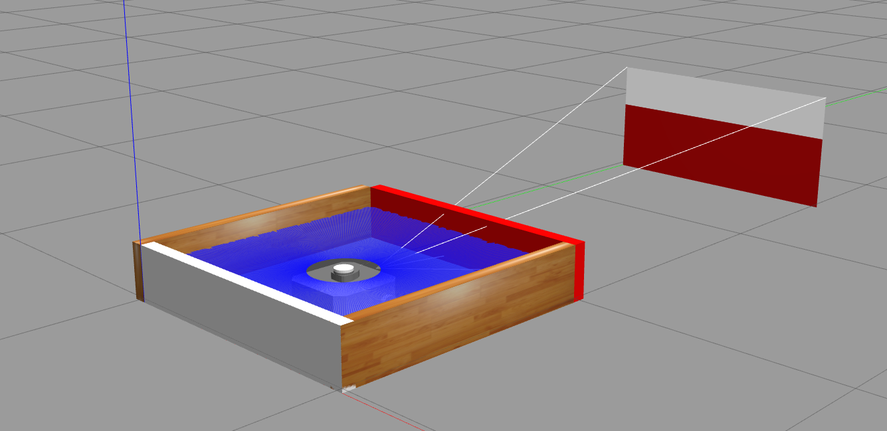

Figure 1: Gazebo simulation of the robot and world for challenge 0

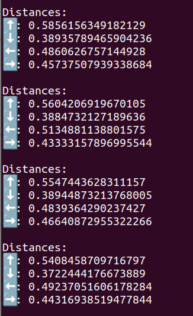

Figure 2: Distances in the four directions as collected by the LDS system

## Challenge 1

### Problem

1. The robot has to be driven as close as possible to the wall and stop without colliding with the wall.
2. The robot should not start or stop suddenly. The change in velocity of the robot should be gradual.
3. Noise would be present in the values that are being collected by the sensor systems. We should figure out a method to alleviate the noise. 

### Relevant concepts

This problem is exclusively solved in the simulation in this stage. 

We need to have the understanding of basic kinematics to solve this problem as we have to keep note at which distance exactly the robot should stop. We should also figure out a way to make the transitions from rest to motion and vice versa smooth. 

- **Minimum distance from the wall:** This is the minimum distance from the wall before which the robot is supposed to stop. It is imperative that this distance is at least as great as half of the width of the robot as the Laser distance system is placed at the center of the robot.We also introduce some padding to prevent the robot from touching the wall.

- **Acceleration and deceleration:** Instead of suddenly starting and stopping the robot, we use kinematic concepts which are bound by any motion like acceleration and deceleration. These quantities signify the change in velocity. So, by introducing concepts like this in contrast to giving the velocity directly to the robot makes the motion smooth and prevents physical damage to the parts of the robots caused by these sudden changes in the velocity.The distance at which we have to start decelerating so that the robot exactly stops at the given distance from the wall can be calculated using the corresponding kinematic relations between the quantities.

- **Moving Average window:** Any data collected by the sensors is prone to some noise. So, instead of taking discrete values of the sensor data, using a ***moving average window*** will reduce the irregularities in the data. In this method a suitable window size is selected and instead of taking the discrete data values, the average of the values of the size of the selected window are considered as data points. We slide the window to accommodate new points.

  
### Approach

We collect the distance values from the Laser distance system as we have done in Challenge 0. But, instead of using these distance values directly, we use a ***moving average window*** across these values to reduce the irregularities in the data and alleviate the noise.

We can set the speed of the robot using the ***vel function*** which takes the linear and angular velocity arguments in percentages. We need to make the velocity as a function of distance to achieve the required motion. We use this function to give a linear velocity to the robot until the distance value is greater than a threshold value and stop the velocity after the robot has reached the required distance.

To make the motion smooth, we start accelerating the robot smoothly. We cap the velocity by choosing a maximum velocity. After the robot reaches the maximum velocity, the robot stops accelerating and starts to move at a constant velocity. The distance at which the robot should start decelerating is previously calculated using the physical relations between the kinematic quantities. And as planned, when the robot reaches the threshold distance from the wall, it stops.  

 
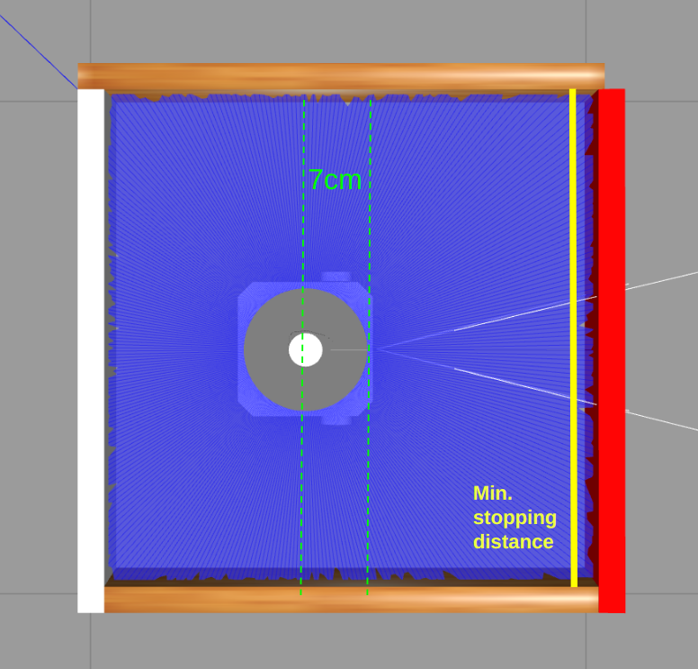

Figure 3: Minimum distance at which the robot stops

### Results and Takeaways

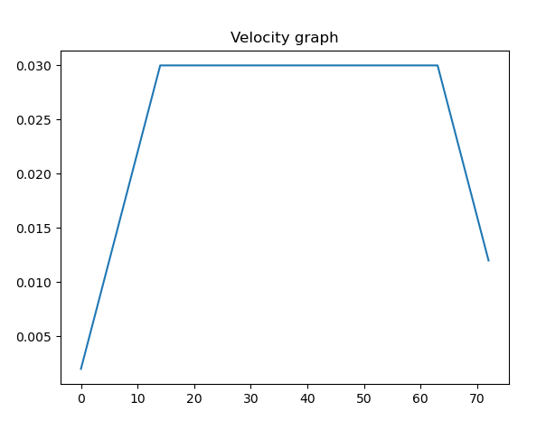

Figure 4: Comparing the smoothing effect of the moving average windows with different window sizes

We can observe that with an increase in window size, the smoothing effect has been increased.

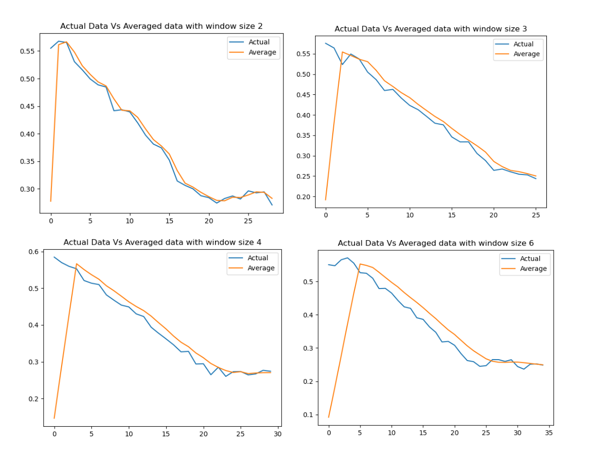

Figure 5: Velocity Vs Distance graph

## Challenge 2

### Problem

 The robot has been placed at the center of the space surrounded by four walls.The robot has to rotate 90 degrees in counter-clockwise direction without any translation. The rotation should only be based on Laser distances (LiDAR values). Odometry should not be used

### Relevant concepts

This problem is solved in simulation and the same concepts and algorithms have been applied to the real-world as well. 

- **Bias between the LiDAR and axis of rotation:** We can observe that the LiDAR is placed around the center of the robot. But, the axis of rotation is between the wheels as shown in the figure. So, the corresponding bias has to be accounted for, while calculating the angle of rotation using the laser distance values. (Distances are being calculated from a different point and the robot is rotating with respect to a different point)

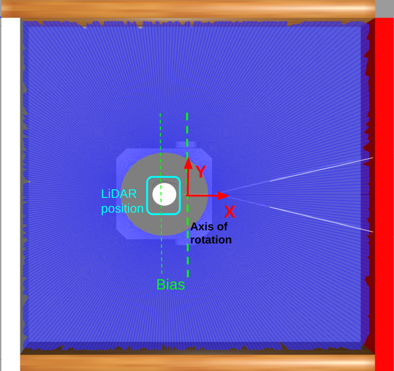 

Figure 6: Bias between the LiDAR position and the axis of rotation

  
### Approach 1

We have tried to take the forward distance of the robot from the forward wall. We have transformed and corrected this forward distance taking the bias created by different positions of Laser distances and axes of rotation into consideration. As the robot rotates, the forward distance value changes. We have used trigonometry to identify the change in value of angles corresponding to change in forward distances. This approach worked good until 45 degrees anti-clockwise. But, later on the other wall started to affect the distance values. We have identified that this can still work for 90 degree rotation. But, if we want to rotate more, the symmetry of the environment can cause problems to the rotation of the robot as this creates similar forward distance values at multiple points surrounding the robot. 

### Approach 2

(All the distances we talk below are corrected taking the bias caused by difference of axis of rotation and position of LiDAR into account)

Instead of taking only the forward distance, we have decided to take the distance values in all the 360 degrees. In the first instance, the robot takes the distance values in all the 360 degrees and store in a list. We rotate this list, by shifting the elements of the list by 90 to understand how the distance values list would look like when the robot is facing 90 degrees in the counter clockwise direction. Let us call this the ***target list***.

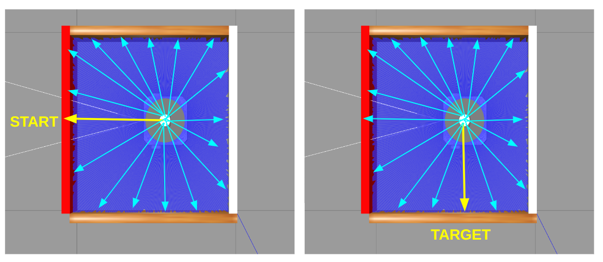

Figure 7: Calculating target list from initial values

 Now, as we rotate slowly in counter clockwise direction, we compare the laser distances collected by the LiDAR with the ***target list*** and stop rotating when the mean of differences between the lists(error) is minimum  

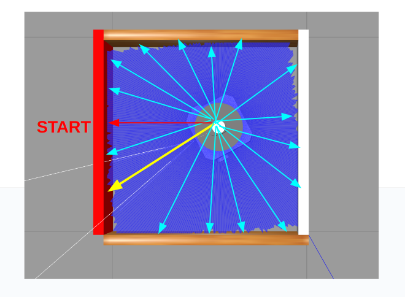

Figure 8: Computing angle by comparing different distance values at all angles

### Results and takeaways

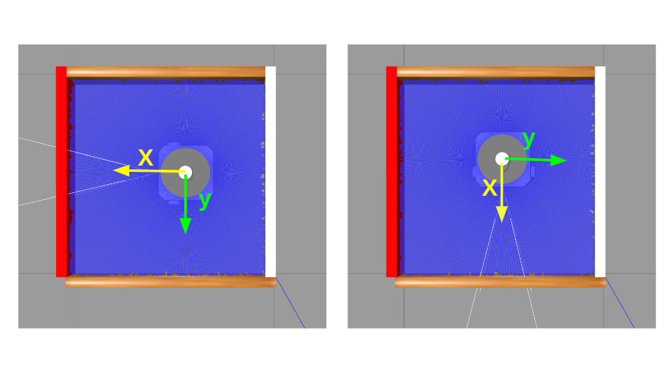

Figure 9: Rotation of the robot by 90 degrees in counter clockwise direction

Although my algorithm has worked perfectly in the simulation, we have faced interesting problems in the real world. 

1. We have observed that the number of values by the LiDAR placed on the top of the robot is not always 360. This caused indexing errors in our codes which are made for perfect simulation scenarios where the number of values from the LiDAR are always 360.
2. We have observed that the robot sensors in real world are also susceptible to ***"nan"*** values sometimes. This caused some computational problems in our algorithms.

Unfortunately, we are still working on making the changes relevant to these real world situations and due to time constraints, we had to move on to the next challenge without making all the relevant changes required.

## Challenge 3

### Problem

1. In challenge 3 we use the position and orientation by odometer sensors on the robot instead of the values provided by Laser distance system.
2. The robot has to drive 15 cm ahead, turn 90 degrees in the clockwise direction and move ahead 15 cm again. 

### Relevant concepts

This problem is solved both in simulation and real world. 

To solve this problem, these are the concepts which have to be understood.  

- **Quaternions and Euler Angles:** Euler angles are the roll, pitch and yaw angles i.e., the angles with respect to x,y and z axes respectively. However, simulations are prone to a problem called "Gimbal Lock" where certain orientations can cause to lose a single degree of freedom. Hence, simulations and algorithms typically use quaternions instead of Euler angles. Quaternions are also simple to represent. They have four values w,x,y and z. The odometry sensor in the robot gives us these four values in the above order. Hence, we should first convert the orientation values in quaternions into Euler angles to understand what is the current angle of rotation.   

- **Transformation of odom origin to odom start:** To understand the current angle of rotation, it is important to have a good initial position and orientation to compare. In simulations, this initial value of position and orientation can be fixed. However, in the real world, the initial position and orientation of the robot would be arbitrary depending on the earth's magnetic field and robot's relative position and orientation with respect to it. Hence, we follow the practice of making the initial pose (position and direction) of the robot as zero and make all our calculations with respect to this initial position. We call this initial pose ***"odom start"*** or ***"zero"***. All the goal positions and orientations are calculated with respect to this new ***"odom start"*** or ***"zero"***. I

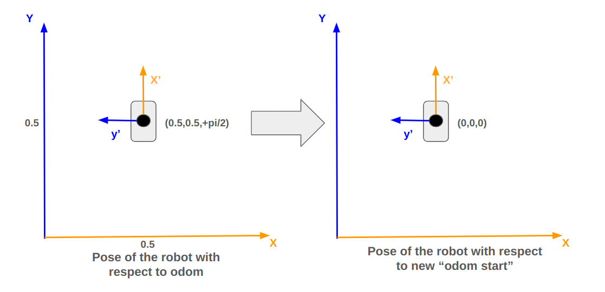

Figure 10: Transformation of odom to odom start

- **State Machines:** We have to understand the idea of state machines to make our job easier while giving instructions to the robot. Normally, we can use flags to let the robot know the status of the current activity and the need to switch to a new activity. But, when we are dealing with multiple instructions, this can create a messy situation involving a lot of flags. So, we can use this concept called state machines and create multiple states.

  
### Approach

We define a state machine with different states. We keep the robot it one state when it is pursuing one goal and when the robot successfully achieved the goal we change the state to let the robot know that current task is finished and it has to update its goal.

We get the current position and orientation of the robot defining a callback function similar to how we did when collecting the laser distances. As the orientation we get directly from the odometry sensors is in the form of quaternions, we convert them into Euler angles to understand the robot's current angle of rotation.

We define multiple goals with respect to the new ***"odom start"*** or ***"zero"*** and state in which the robot is currently in determines the robot's current goal which the robot has to achieve.
 
### Results and Takeaways

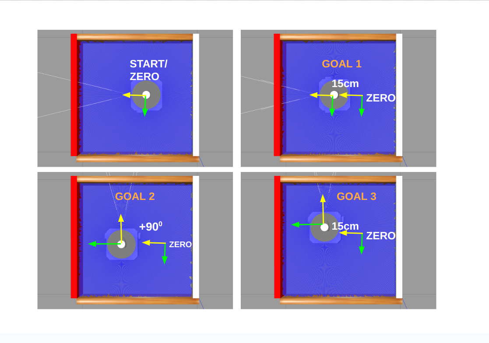

Figure 11: Goals of Robot

## Challenge 4

### Problem

In challenge 4, we are required to move to the top and right most cell without any collisions and stop.

### Relevant concepts

This problem is solved both in simulation and real world. 

To solve this problem, we need to understand all the concepts implemented in Challenges 2 and 3. We should also use the values from the laser distance system to identify the position of walls. Then we formulate a plan for moving the robot to the target cell from the initial position.  
  
### Approach

Two states have been defined in the beginning to determine which system takes the values first i.e LiDAR system or the odometry system. It is important for the LiDAR system to take the values first to understand the environment. 

So, initially the LiDAR system takes the distance values from all directions. Values of distances in the forward direction of the robot and at 30 degrees clockwise direction are used to understand the position of the walls and the path in which the robot has to move will be identified. If there is a wall in the forward direction, the distance value from the robot to the front wall would be smaller and if there is no wall, the distance values would be significantly larger. Similarly, if there is a wall obstructing the robot in the 30 degrees clockwise angle, the corresponding distance value collected by the LiDAR would be small. If not, the value of the distance would be significantly higher.

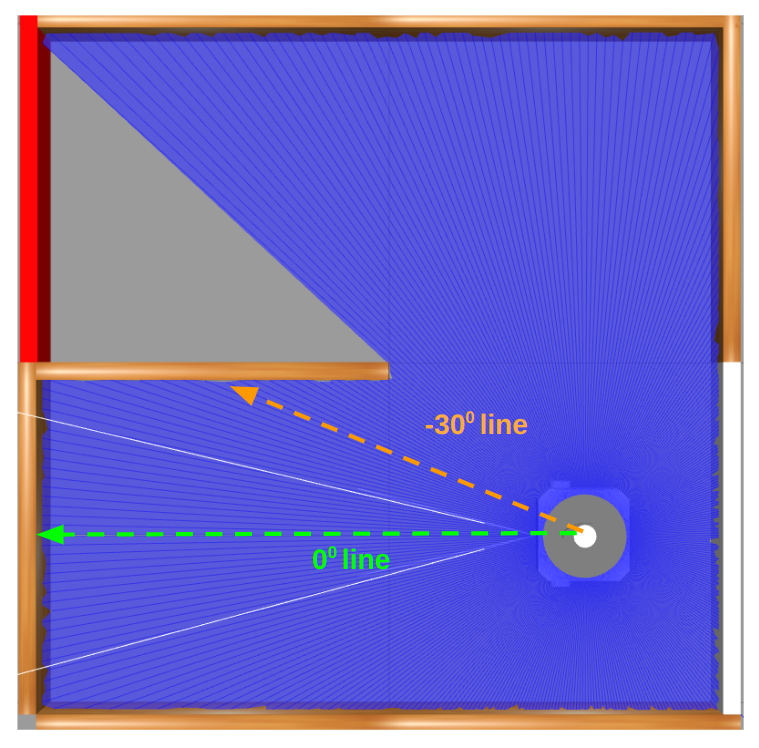

Figure 12: Taking the two important distances from the LDS

We can see that the robot can have two possible ways in which it can move based on the four possible positions of the wall. If the wall is at 1 or 3 as shown in the figure below, the robot has to turn 90 degrees in clockwise direction, move forward to the next cell, turn 90 degrees in the counter clockwise direction and move forward. This would result in the robot moving to the goal cell.

Similarly, if the wall is at 2 or 4 as shown in the figure below, the robot has to move forward to the next cell, turn 90 degrees in the clockwise direction and move forward. This would take the robot to the goal cell.

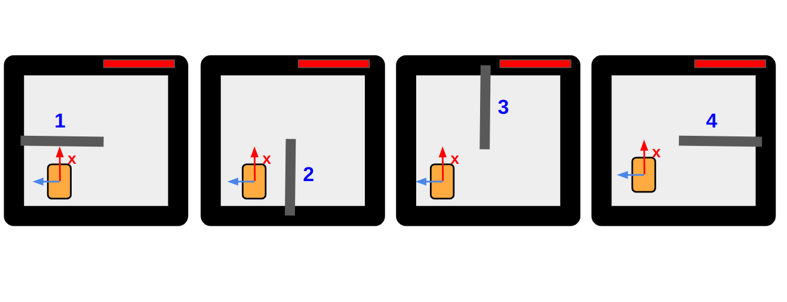

Figure 13: Identifying the position of walls

We define two different states for these two possible robot motions and the goals of the robot are set according to the state in which the robot is in.
 
### Results and Takeaways

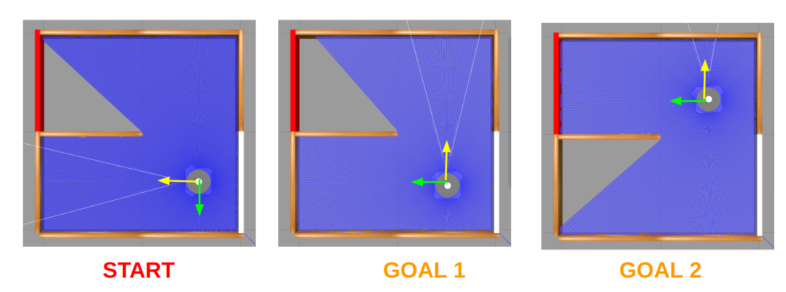

Figure 14: Goals 1,2 of Robot

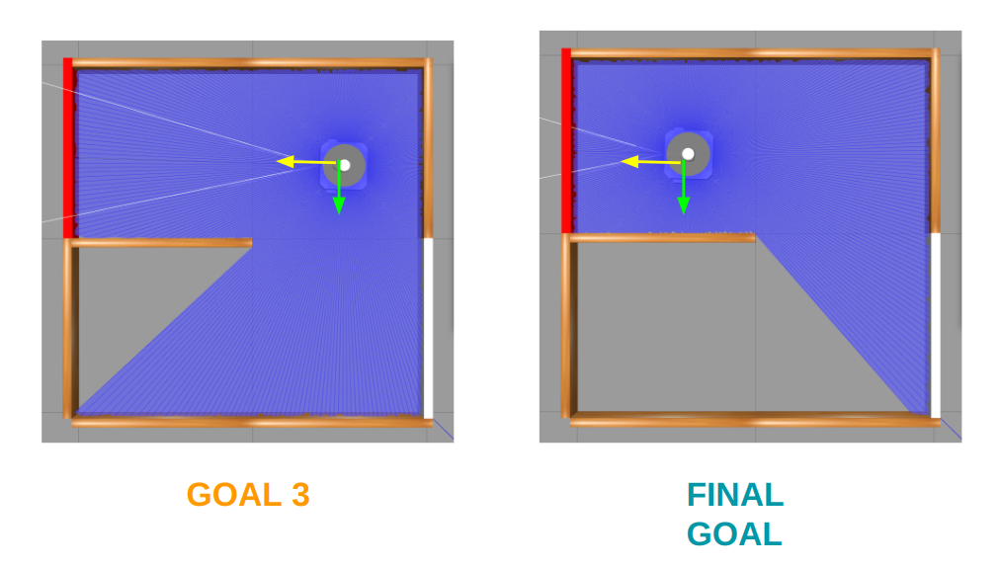

Figure 15: Final Goals of Robot

## Link to the repository of all code files

## Acknowledgements

I would like to sincerely thank the professor Aydos Gökçe who offered the course “PLV: Robot Programming” at Technische Hochschule Deggendorf(THD) during winter semester 23/24 and for allowing us to be a part of this course. Setting up the environment is one of the most difficult parts of the project and it has been very easy by cloning the repositories provided by the professor. The challenges were monumental in building our concepts and skills incrementally, from the foundation level to the final deployment on the robot. The insights discussed by the professor have been instrumental in developing the algorithms. I would also like to thank my fellow classmates, especially Bahrami Cheshmehali Javad and Sreehari Giridharan. We often discussed the ideas thoroughly before starting coding. Javad especially helped me get through Challenge 2, even in troubleshooting few sections of my code and implementing his ideas as well. I would also like to mention that in few sections of the report, CHATGPT has been used to improve the readability of the report by correcting grammatical mistakes and such. Overall, this has been a transformative journey teaching us a lot of stuff, more importantly, it succeeded in creating the interest in us to learn more. 

